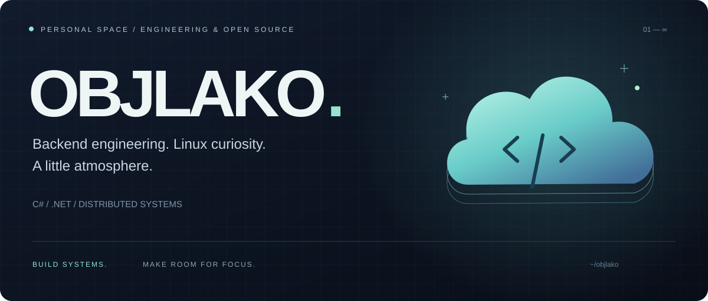

  

  <a href="#engineering">Engineering</a> · <a href="#milestones">Milestones</a> · <a href="https://github.com/OBJLAKO?tab=repositories">All repositories ↗</a>

 

I’m a **backend engineer focused on C# and .NET**, with interests in distributed systems, enterprise integrations and Linux. I enjoy understanding how things work — from backend services to the Linux desktop — and making everyday tools feel more personal.

## Engineering

**Primary focus** &nbsp; C# · .NET · backend services · enterprise integrations

| Data & messaging | Infrastructure | Architecture |
| :--- | :--- | :--- |
| PostgreSQL · MongoDB · Oracle | Docker · Kubernetes | Clean Architecture · DDD |
| RabbitMQ | Linux | Microservices · CQRS |

**Also in my toolbox** &nbsp; Java · Go

## Milestones

**2025 — Best Young Specialist · MMK-Informservice** 
PunchOut protocol integration into corporate procurement.

**2025 — 2nd place · International stage** 
XXV Scientific-Technical Conference of Young Specialists. 
*PunchOut Integration for Automated B2B Procurement.*

 

  
<strong>Off the main thread — algorithm practice</strong>

   
  <a href="https://leetcode.com/OBJLAKO/">LeetCode profile ↗</a> · <a href="https://github.com/OBJLAKO/leetCode">Solutions repository ↗</a>

 

---

OBJLAKO · Backend systems, open-source experiments & a calmer desktop.

