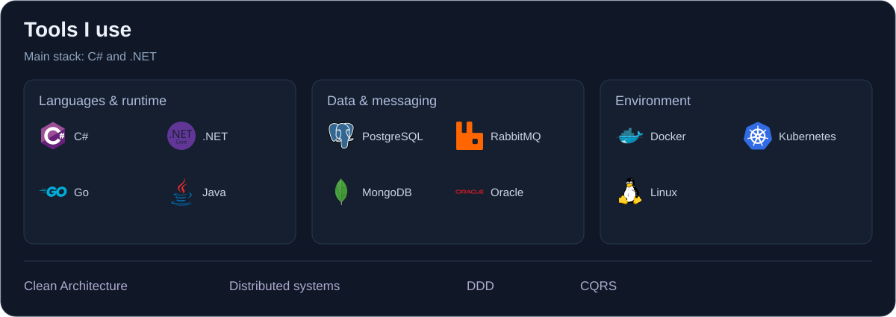
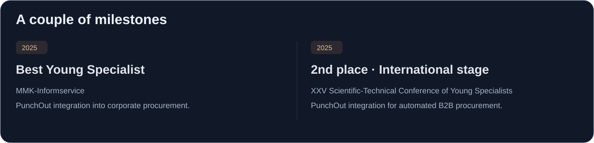
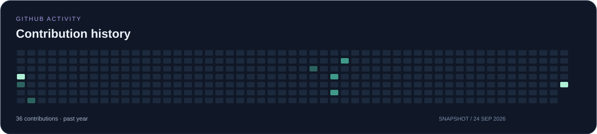
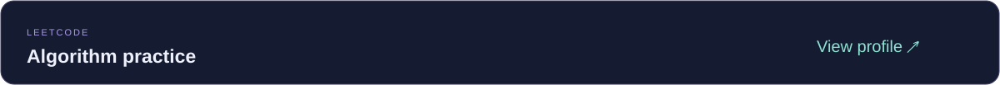

  

  I work on backend services and enterprise integrations with <strong>C# and .NET</strong>. 
  Outside of work, I experiment with Linux and build small tools.

  <a href="#engineering">Engineering</a> &nbsp; / &nbsp;
  <a href="#milestones">Milestones</a> &nbsp; / &nbsp;
  <a href="https://github.com/OBJLAKO?tab=repositories">Explore GitHub ↗</a>

 

 
 

 
 

 
 

 

OBJLAKO · C# / .NET · Linux

