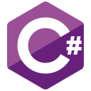
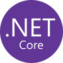

<h1 align="center">☁️ OBJLAKO</h1>

<strong>Backend engineer · C# / .NET</strong>

  I build backend services and enterprise integrations. 
  Outside of work: Linux experiments and small tools.

  <a href="https://github.com/OBJLAKO?tab=repositories">Repositories ↗</a> &nbsp; · &nbsp;
  <a href="https://leetcode.com/OBJLAKO/">LeetCode ↗</a>

## Engineering

| | Technologies |
| :--- | :--- |
| **Core** |  C# &nbsp;  .NET |
| **Data & messaging** |  PostgreSQL &nbsp;  Oracle &nbsp;  MongoDB &nbsp;  RabbitMQ |
| **Infrastructure** |  Docker &nbsp;  Kubernetes &nbsp;  Linux |
| **Also in my toolkit** |  Go &nbsp;  Java |

`Clean Architecture` &nbsp; `DDD` &nbsp; `CQRS` &nbsp; `Distributed systems`

## Milestones

**2025 · Best Young Specialist** 
MMK-Informservice — PunchOut integration into corporate procurement.

**2025 · 2nd place, international stage** 
XXV Scientific-Technical Conference of Young Specialists. 
PunchOut integration for automated B2B procurement.

## Contribution trail

<picture>
  <source media="(prefers-color-scheme: dark)" srcset="https://raw.githubusercontent.com/OBJLAKO/OBJLAKO/output/github-snake-dark.svg" />
  <source media="(prefers-color-scheme: light)" srcset="https://raw.githubusercontent.com/OBJLAKO/OBJLAKO/output/github-snake.svg" />
  
</picture>

OBJLAKO · C# / .NET · Linux

